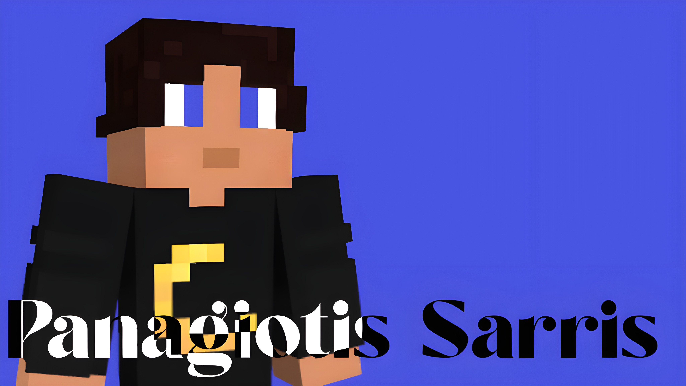

# Sarris.dev

My Personal portfolio and web playground.

[Live Site](https://sarris.dev)

## Some resources



## Features

- Multi-page portfolio with React + TypeScript
- Real-time "Now Playing" widget powered by Last.fm API
- Admin dashboard with secure PIN unlock
- Custom text stroke animations and interactive cursor
- SEO-ready metadata and sitemap
- Deployed on Vercel

## Tech Stack

- **Framework**: React 18
- **Build**: Vite
- **Routing**: React Router DOM
- **Styling**: Tailwind CSS
- **Language**: TypeScript
- **Deployment**: Vercel
- **Database**: Upstash Redis

## Run Locally

```bash
npm install
npm run dev
```

Open `http://localhost:5173` in your browser.

## Project Structure

```text
.
├─ api/                       # Vercel serverless functions
├─ public/                    # Static assets (images, sitemap, robots.txt)
├─ src/
│  ├─ components/             # React components
│  │  ├─ sections/            # Page section components
│  │  └─ *.tsx                # Shared components & hooks
│  ├─ pages/                  # Page-level components
│  ├─ App.tsx                 # Router configuration
│  └─ main.tsx                # App entry point
├─ index.html
├─ vite.config.ts
├─ vercel.json
├─ sitemap.xml (public/)
└─ robots.txt (public/)
```

## Pages

| Route | Description |
|-------|-------------|
| `/` | Main portfolio landing page |
| `/cloud` | Cloud AI project page |
| `/edc-setup` | EDC (everyday carry) showcase |
| `/windows` | My Windows setup page |
| `/admin` | Now Playing admin dashboard (PIN-protected) |

## Environment Variables

| Variable | Description |
|----------|-------------|
| `last_fm_api` | Last.fm API key (or `LAST_API` as fallback) |
| `ADMIN_PASSWORD` | Admin dashboard PIN |
| `KV_REST_API_URL` | Upstash Redis URL |
| `KV_REST_API_TOKEN` | Upstash Redis token |

## License

This repository is for personal portfolio use. Use any asset just put some credits.